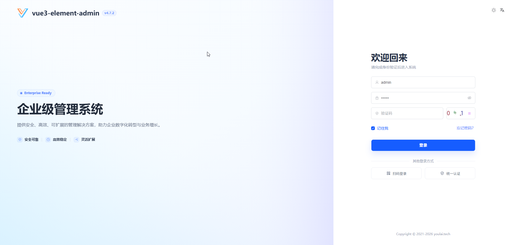

<div align="center">

#  youlai-think


**ThinkPHP 企业级权限管理系统后端**

[](https://www.php.net/)
[](https://www.thinkphp.cn/)
[](LICENSE.txt)
[](https://gitee.com/youlaiorg/youlai-think/stargazers)
[](https://github.com/youlaitech/youlai-think)

</div>


<div align="center">

[](https://vue.youlai.tech)
[](https://app.youlai.tech)
[](https://www.youlai.tech/docs/server/thinkphp/)
[](./README.en.md)

</div>

## 项目简介

**youlai-think** 是一套基于 ThinkPHP 的企业级权限管理系统后端，配套前端 [vue3-element-admin](https://gitee.com/youlaiorg/vue3-element-admin) 和移动端 [youlai-app](https://gitee.com/youlaiorg/youlai-app)，并提供 **7 种语言实现**（Java / Node.js / Go / Python / PHP / C# / Rust），共享同一套 API 规范与数据库结构。适用于企业中后台管理系统的学习参考与二次开发。

## 核心特性

- 🔐 **安全体系** — JWT + Redis Token 双会话模式、令牌续期、多端互斥
- 🛡️ **细粒度权限** — RBAC 权限模型，菜单/按钮/接口统一治理
- ⚡ **代码生成器** — 一键生成前后端 CRUD 代码
- 📦 **模块齐全** — 用户、角色、菜单、部门、字典、文件、消息中心、操作日志
- 🔌 **实时通信** — SSE 推送：在线用户数、字典同步、通知广播

## 系统预览

**PC 端**

<table align="center">
  <tr>
    <td></td>
    <td></td>
  </tr>
  <tr>
    <td></td>
    <td></td>
  </tr>
  <tr>
    <td></td>
    <td></td>
  </tr>
</table>

**移动端**

<table align="center">
  <tr>
    <td></td>
    <td></td>
    <td></td>
    <td></td>
  </tr>
</table>

## 快速开始

**环境要求**：PHP 8.2+ · Composer · MySQL 8.0+ · Redis 7.x+

1. 克隆项目：`git clone https://gitee.com/youlaiorg/youlai-think.git`
2. 导入数据库：`sql/mysql/youlai_admin.sql`
3. 修改配置（可选，默认已配置线上只读数据源）：`.env`
4. 安装依赖：`composer install`
5. 启动服务：`php think run`，访问 http://localhost:8000

默认账号：`admin` / `123456`

详细指南：[部署文档](https://www.youlai.tech/docs/server/thinkphp/deploy)

## 目录结构

```
youlai-think/
├── app/                            # 应用目录
│   ├── auth/                       # 认证模块（登录/鉴权）
│   ├── system/                     # 系统模块（用户/角色/菜单/部门/字典/通知/日志）
│   ├── codegen/                    # 代码生成模块
│   ├── file/                       # 文件管理模块
│   ├── message/                    # SSE 消息推送
│   ├── common/                     # 公共模块（模型/枚举/异常/中间件/事件）
│   └── BaseController.php          # 基础控制器
├── config/                         # 应用配置
├── database/                       # 数据库迁移与填充
├── public/                         # WEB 目录（入口文件/资源文件）
├── route/                          # 路由定义
├── sql/                            # 数据库初始化脚本
├── vendor/                         # Composer 依赖
├── composer.json                   # Composer 配置
└── .env                            # 环境配置
```

## 生态矩阵

**前端**

| 项目 | 技术栈 | 说明 |
|:-----|:-------|:-----|
| [vue3-element-admin](https://gitee.com/youlaiorg/vue3-element-admin) | Vue 3 + Element Plus | PC 管理前端（主推） |
| [youlai-app](https://gitee.com/youlaiorg/youlai-app) | Vue 3 + UniApp | 移动端 App |

**后端**

| 项目 | 技术栈 | 说明 |
|:-----|:-------|:-----|
| [youlai-boot](https://gitee.com/youlaiorg/youlai-boot) | Spring Boot + MyBatis-Plus | Java（主推） |
| [youlai-nest](https://gitee.com/youlaiorg/youlai-nest) | NestJS + TypeORM | Node.js |
| [youlai-gin](https://gitee.com/youlaiorg/youlai-gin) | Go + Gorm | Go |
| [youlai-django](https://gitee.com/youlaiorg/youlai-django) | Django + DRF | Python |
| [youlai-fastapi](https://gitee.com/youlaiorg/youlai-fastapi) | FastAPI + SQLAlchemy | Python |
| [youlai-think](https://gitee.com/youlaiorg/youlai-think) | ThinkPHP + ThinkORM | PHP |
| [youlai-aspnet](https://gitee.com/youlaiorg/youlai-aspnet) | ASP.NET Core + EF Core | C# |
| [youlai-axum](https://gitee.com/youlaiorg/youlai-axum) | Axum + SeaORM | Rust |

> **youlai-boot** 还提供以下变种和分支版本：[多租户](https://gitee.com/youlaiorg/youlai-boot-tenant)· [MyBatis-Flex](https://gitee.com/youlaiorg/youlai-boot-flex)· [Spring Boot 3](https://gitee.com/youlaiorg/youlai-boot/tree/spring-boot-3) · [PostgreSQL](https://gitee.com/youlaiorg/youlai-boot/tree/db-pg) · [多模块](https://gitee.com/youlaiorg/youlai-boot/tree/multi-module)
>
> 八种后端共享同一套 **RESTful API 规范** 和 **数据库结构**，前端可无缝切换。

## 技术合作

本项目采用 [Apache License 2.0](LICENSE) 开源，可免费商用。欢迎在 [Issue](https://gitee.com/youlaiorg/youlai-think/issues) 提交问题或反馈，也欢迎提交 [Pull Request](https://gitee.com/youlaiorg/youlai-think/pulls) 共建。

如需技术支持、商务合作、二次开发、项目定制或私有化部署，可联系作者微信（见下方二维码）。

<table align="center">
  <tr>
    <td align="center">
      <br>
      <sub>公众号「有来技术」</sub>
    </td>
    <td>&nbsp;&nbsp;&nbsp;&nbsp;</td>
    <td align="center">
      <br>
      <sub>小程序「有来技术」</sub>
    </td>
    <td>&nbsp;&nbsp;&nbsp;&nbsp;</td>
    <td align="center">
      <br>
      <sub>添加作者微信</sub>
    </td>
  </tr>
</table>

<p align="center"><em>技术交流 · 问题反馈 · 商务合作</em></p>
